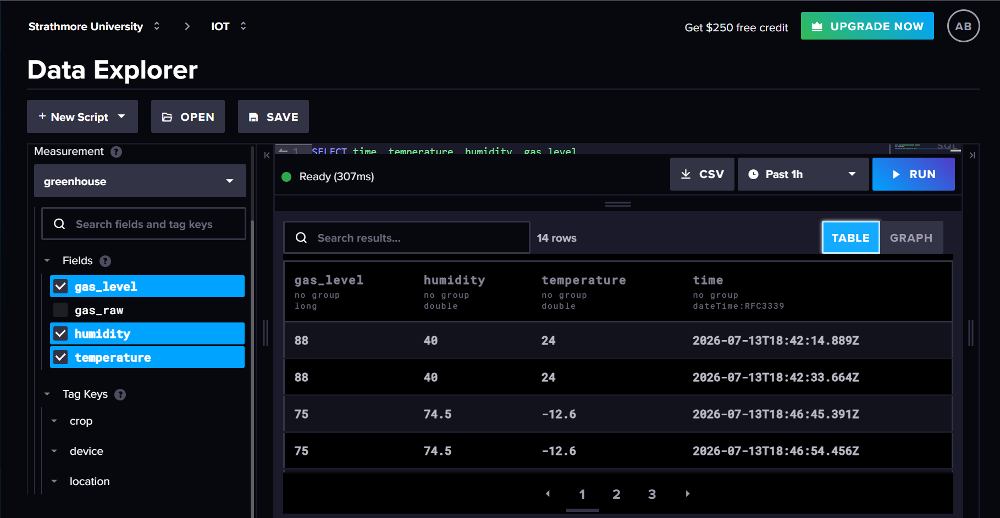

# Deliverable 3: Cloud Data Transmission and Visualisation

**Course:** Internet of Things
**Institution:** Strathmore University, School of Computing and Engineering Sciences
**Group:** Ohm Sweet Ohm
**Project:** Greenhouse Environmental Monitoring System

---

## 1. Objective

Transmit sensor data from an ESP32-based device to a cloud time-series database and visualise the stored data on a dashboard.

This deliverable extends the Flora Farms greenhouse monitoring system, which tracks environmental conditions in a daisy greenhouse in Naivasha. The device measures temperature, humidity and combustible gas levels, displays them locally, and streams them to the cloud for storage and analysis.

---

## 2. Device Architecture

The prototype implements the required architecture:

> 1 ESP32S connected to 1 MQ-5, 1 DHT22 and 1 display

| Component | Role |
|---|---|
| ESP32-S | Microcontroller, sensor polling, WiFi transmission |
| DHT22 | Temperature and relative humidity sensor |
| MQ-5 | Combustible gas sensor (LPG / natural gas) |
| SSD1306 OLED | Local display of live readings |

### 2.1 Wiring

| Component | Pin | ESP32 Pin |
|---|---|---|
| DHT22 | VCC | 3V3 |
| DHT22 | GND | GND |
| DHT22 | DATA | GPIO5 |
| Gas sensor | VCC | 3V3 |
| Gas sensor | GND | GND |
| Gas sensor | AOUT | GPIO34 |
| OLED | VCC | 3V3 |
| OLED | GND | GND |
| OLED | SDA | GPIO21 |
| OLED | SCL | GPIO14 |

### 2.2 Design Notes

**GPIO34 for the analog input.** GPIO34 is an input-only pin on ADC1. ADC2 pins cannot be used for analog reads while WiFi is active, which is a hard constraint for this deliverable since the device transmits over WiFi continuously. GPIO34 avoids that conflict.

**Voltage divider on the physical build.** The MQ-5 heater runs at 5V and its analog output can swing above the ESP32's 3.3V ADC ceiling. The physical circuit therefore uses a 10k / 20k resistor divider on the MQ-5 output line to step the signal down. This is not required in the simulation, where the sensor part outputs a safe range directly.

**Sensor substitution in simulation.** Wokwi does not provide an MQ-5 part. The MQ2 gas sensor part (`wokwi-gas-sensor`) is used as a stand-in. Both are analog combustible gas sensors read via `analogRead()`, so the interfacing logic and the data pipeline are identical. The MQ-5 is the sensor specified in the schematic and used in the physical build.

**Preheat.** A physical MQ-5 requires a warm-up period before readings stabilise. The simulation returns values immediately.

---

## 3. Simulated Prototype

The prototype is implemented as a public Wokwi simulation.

**Wokwi project:** https://wokwi.com/projects/469457762534362113



The simulation connects to the internet through Wokwi's virtual WiFi network (`Wokwi-GUEST`), which allows the simulated ESP32 to make real HTTPS requests to InfluxDB Cloud. Data written from the simulation is therefore genuinely stored in the cloud database, not mocked.

---

## 4. Firmware

### 4.1 Libraries

| Library | Purpose |
|---|---|
| DHT sensor library | DHT22 driver |
| Adafruit GFX Library | Graphics primitives |
| Adafruit SSD1306 | OLED driver |
| ESP8266 Influxdb | InfluxDB client (supports ESP32 despite the name) |

### 4.2 Source Code

```cpp
#include <WiFi.h>
#include <Wire.h>
#include <Adafruit_GFX.h>
#include <Adafruit_SSD1306.h>
#include <DHT.h>
#include <InfluxDbClient.h>
#include <InfluxDbCloud.h>

//WiFi (Wokwi's virtual network)
#define WIFI_SSID     "Wokwi-GUEST"
#define WIFI_PASSWORD ""

//InfluxDB Cloud
#define INFLUXDB_URL    "https://us-east-1-1.aws.cloud2.influxdata.com"
#define INFLUXDB_ORG    "IOT"
#define INFLUXDB_BUCKET "flora_farms"
#define INFLUXDB_TOKEN  "<REDACTED>"

//Pins
#define DHT_PIN   5
#define DHT_TYPE  DHT22
#define MQ_PIN    34
#define I2C_SDA   21
#define I2C_SCL   14

#define SCREEN_WIDTH  128
#define SCREEN_HEIGHT 64

DHT dht(DHT_PIN, DHT_TYPE);
Adafruit_SSD1306 display(SCREEN_WIDTH, SCREEN_HEIGHT, &Wire, -1);
InfluxDBClient client(INFLUXDB_URL, INFLUXDB_ORG, INFLUXDB_BUCKET,
                      INFLUXDB_TOKEN, InfluxDbCloud2CACert);

Point sensorData("greenhouse");

void setup() {
  Serial.begin(115200);
  dht.begin();

  Wire.begin(I2C_SDA, I2C_SCL);
  display.begin(SSD1306_SWITCHCAPVCC, 0x3D);
  display.clearDisplay();
  display.setTextColor(SSD1306_WHITE);
  display.setTextSize(1);
  display.setCursor(0, 0);
  display.println("Flora Farms");
  display.println("Connecting WiFi...");
  display.display();

  //Connect to Wokwi's virtual WiFi 
  WiFi.begin(WIFI_SSID, WIFI_PASSWORD, 6);
  Serial.print("Connecting WiFi");
  while (WiFi.status() != WL_CONNECTED) {
    Serial.print(".");
    delay(300);
  }
  Serial.println(" connected!");

  //Time sync is required: TLS certificate validation fails without a correct clock
  timeSync("UTC", "pool.ntp.org", "time.nis.gov");

  //Tags allow filtering and grouping in Grafana
  sensorData.addTag("device", "ESP32");
  sensorData.addTag("location", "naivasha_greenhouse");
  sensorData.addTag("crop", "daisy");

  if (client.validateConnection()) {
    Serial.print("Connected to InfluxDB: ");
    Serial.println(client.getServerUrl());
  } else {
    Serial.print("InfluxDB connection FAILED: ");
    Serial.println(client.getLastErrorMessage());
  }

  delay(1000);
}

void loop() {
  float temp = dht.readTemperature();
  float hum  = dht.readHumidity();
  int   raw    = analogRead(MQ_PIN);
  int   gasPct = map(raw, 0, 4095, 0, 100);

  //Local display
  display.clearDisplay();
  display.setCursor(0, 0);
  if (isnan(temp) || isnan(hum)) {
    display.println("DHT22 read error");
  } else {
    display.print("Temp: "); display.print(temp, 1); display.println(" C");
    display.print("Hum:  "); display.print(hum, 1);  display.println(" %");
  }
  display.print("Gas:  "); display.print(gasPct); display.println(" %");
  display.display();

  //Write to InfluxDB
  sensorData.clearFields();
  if (!isnan(temp)) sensorData.addField("temperature", temp);
  if (!isnan(hum))  sensorData.addField("humidity", hum);
  sensorData.addField("gas_level", gasPct);
  sensorData.addField("gas_raw", raw);

  Serial.print("Writing: ");
  Serial.println(sensorData.toLineProtocol());

  if (!client.writePoint(sensorData)) {
    Serial.print("InfluxDB write FAILED: ");
    Serial.println(client.getLastErrorMessage());
  } else {
    Serial.println("  -> written OK");
  }

  delay(10000);  //one reading every 10 seconds
}
```

### 4.3 Implementation Notes

**Time synchronisation.** `timeSync()` is called before any write. InfluxDB Cloud uses TLS, and certificate validation requires the device clock to be correct. Without this call the connection fails.

**Field clearing.** `clearFields()` is called at the start of each write cycle. Without it, fields accumulate across iterations of the loop.

**Write interval.** Readings are written every 10 seconds. This is frequent enough to produce a meaningful time series while staying comfortably within the free tier limits.

---

## 5. Cloud Storage: InfluxDB

### 5.1 Configuration

| Setting | Value |
|---|---|
| Platform | InfluxDB Cloud (Serverless, TSM) |
| Organisation | IOT |
| Bucket | `flora_farms` |
| Measurement | `greenhouse` |
| Region | us-east-1 (AWS) |

### 5.2 Data Schema

**Fields (measured values):**

| Field | Type | Unit | Description |
|---|---|---|---|
| `temperature` | float | degrees C | Ambient greenhouse temperature |
| `humidity` | float | percent | Relative humidity |
| `gas_level` | integer | percent | Gas concentration, normalised 0 to 100 |
| `gas_raw` | integer | ADC counts | Raw 12-bit ADC reading, 0 to 4095 |

**Tags (metadata for filtering):**

| Tag | Value | Purpose |
|---|---|---|
| `device` | `ESP32` | Identifies the source device |
| `location` | `naivasha_greenhouse` | Supports multiple deployment sites |
| `crop` | `daisy` | Supports crop-specific analysis |

Storing `gas_raw` alongside the normalised `gas_level` preserves the original sensor reading, which allows the normalisation curve to be recalibrated later without losing data.

### 5.3 Evidence of Stored Data


The table view shows individual timestamped records, confirming that the data is stored as a time series rather than as flat records.

---

## 6. Visualisation: Grafana

### 6.1 Data Source Configuration

| Setting | Value |
|---|---|
| Type | InfluxDB |
| Product | InfluxDB Cloud TSM |
| Query language | Flux |
| URL | `https://us-east-1-1.aws.cloud2.influxdata.com` |
| Organisation | IOT |
| Default bucket | `flora_farms` |

### 6.2 Dashboard


### 6.3 Visualisation 1: Greenhouse Temperature

**Type:** Time series

Tracks ambient temperature over time. Daisies have a relatively narrow optimal temperature band, so trend visibility matters more than any single reading.

```flux
from(bucket: "flora_farms")
  |> range(start: -1h)
  |> filter(fn: (r) => r._measurement == "greenhouse")
  |> filter(fn: (r) => r._field == "temperature")
```

### 6.4 Visualisation 2: Greenhouse Humidity

**Type:** Time series

Tracks relative humidity over time. Sustained high humidity in a greenhouse is a precursor to fungal disease, so the trend is the diagnostic signal, not the instantaneous value.

```flux
from(bucket: "flora_farms")
  |> range(start: -1h)
  |> filter(fn: (r) => r._measurement == "greenhouse")
  |> filter(fn: (r) => r._field == "humidity")
```

### 6.5 Visualisation 3: Gas Level

**Type:** Gauge, with thresholds

Shows the most recent gas reading against colour-coded thresholds. Gas is a safety concern rather than a trend concern: what matters is the current level relative to a danger threshold, which is why a gauge is the appropriate visualisation here rather than a line chart.

| Threshold | Colour | Interpretation |
|---|---|---|
| 0 to 49 | Green | Normal |
| 50 to 74 | Amber | Elevated, monitor |
| 75 to 100 | Red | Alert, possible leak |

```flux
from(bucket: "flora_farms")
  |> range(start: -1h)
  |> filter(fn: (r) => r._measurement == "greenhouse")
  |> filter(fn: (r) => r._field == "gas_level")
  |> last()
```

---

## 7. Verification

The full pipeline was verified end to end:

1. The Wokwi serial monitor confirms successful WiFi connection, successful InfluxDB connection, and a `written OK` acknowledgement for each point.
2. The InfluxDB Data Explorer confirms that the `greenhouse` measurement exists in the `flora_farms` bucket with all four fields and three tags populated.
3. Adjusting the gas sensor slider in Wokwi produces a corresponding movement in the Grafana gauge within one refresh cycle, confirming that the pipeline is live rather than displaying stale data.

---

## 8. Group Contributions

| Member | Contribution |
|---|---|
| Anita | Build the circuit architecture (ESP32 + MQ-5 + DHT22 + display)|
| Arthur | Set up the InfluxDB Cloud account and organisation|
| Silver | Set up Grafana Cloud and connect the InfluxDB data source|
| Isaac | Compile markdown document|
| Sudheysi | Help build circuit architecture and code|

---


