# ICS 4111: Embedded Systems & IoT - Semester Project: Deliverable 2

## A. Prototype A: 1 ESP32S connected to 1 MQ-5, 1 DHT22 and Display

### Device Schematic
* **Device Schematic:**
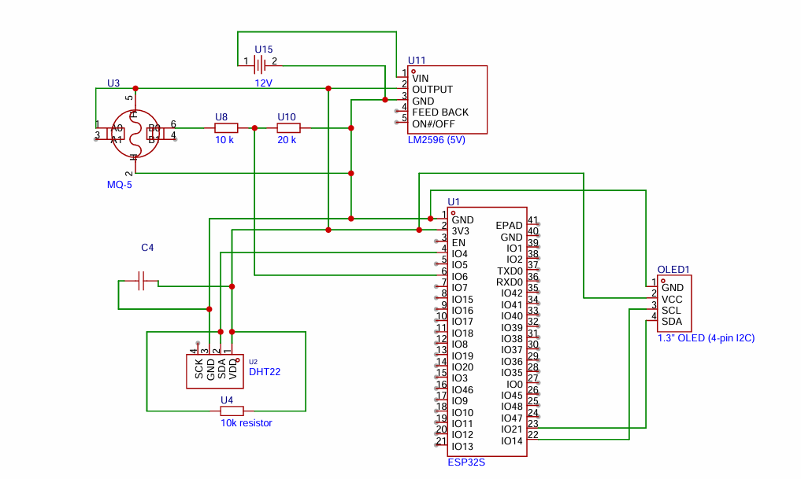

### Simulated Prototype
* **Wokwi Project Link:** [Simulation A Link](https://wokwi.com/projects/468343920186370049)
* **Simulation Schematic:**
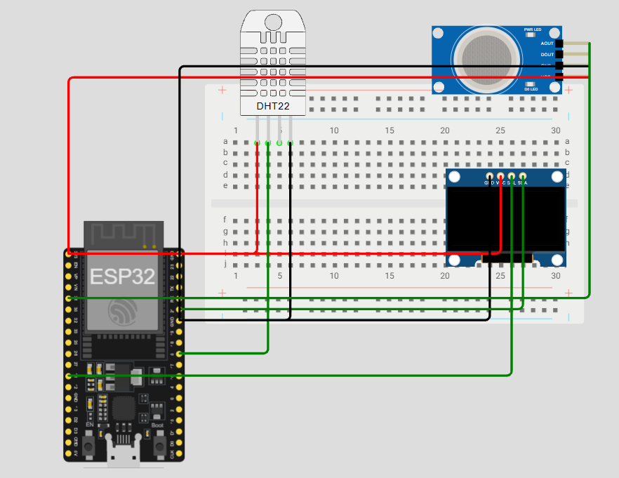

* **Simulation Output:**
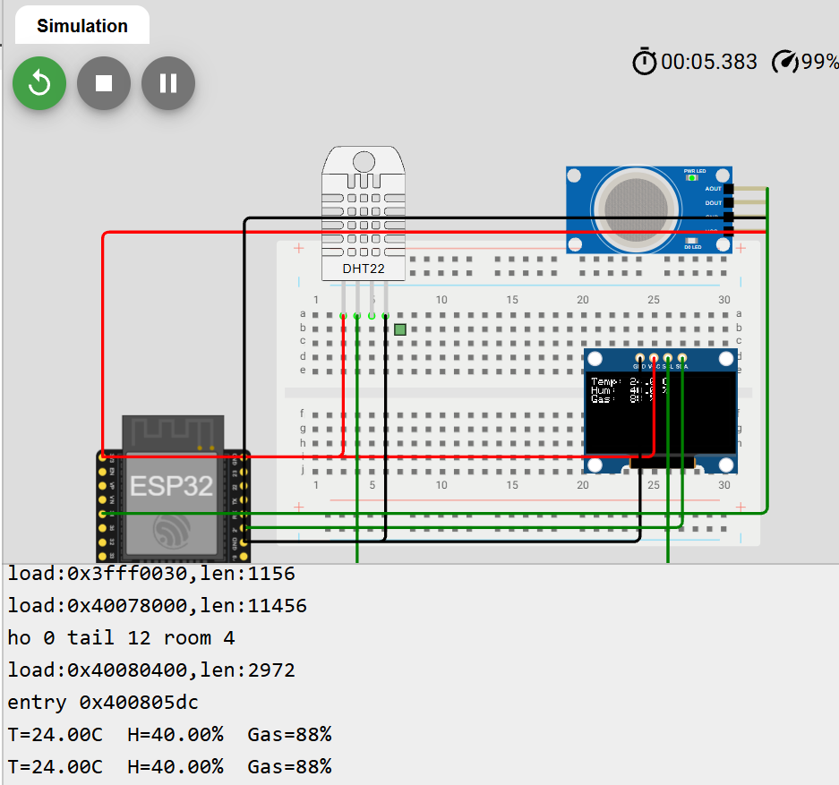

### Physical Prototype
* **Initial Physical Implementation:**

### Challenges Encountered and Resolutions
**Technical Prototyping Issue:** During the physical prototyping phase for this architecture, the initial LCD display (visible in the initial prototype image) was not functioning correctly and failed to display the expected output from the sensors.

**Resolution/Workaround:**
To resolve this issue, the team swapped the malfunctioning LCD for an OLED display. This hardware change was successful, and the OLED properly outputted the sensor readings (Temperature, Humidity, and Gas levels).

* **OLED Output Implementation (Working State):**

---

## B. Prototype B: 1 ESP32S connected to 1 MQ-5 interfaced directly with another ESP32S connected to 1 DHT22

### Implementation Strategy
For this device architecture, our team chose to develop a **physical model**.

### Device Schematic
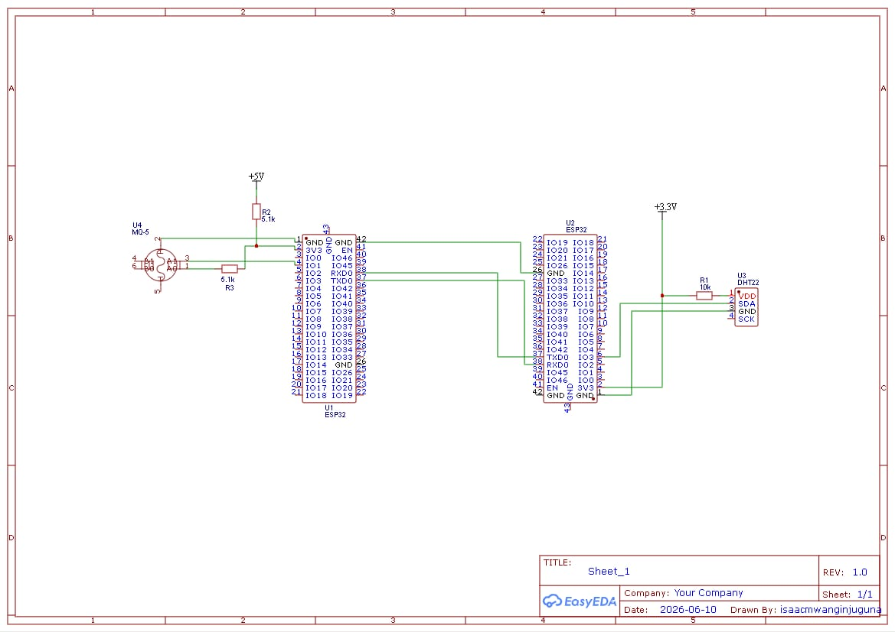

### Physical Prototype Implementation
* **Hardware Setup:**
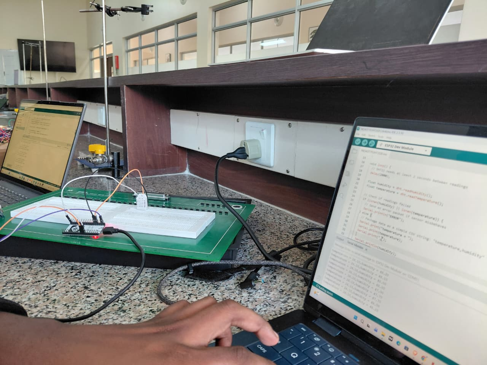

* **Hardware Output:**
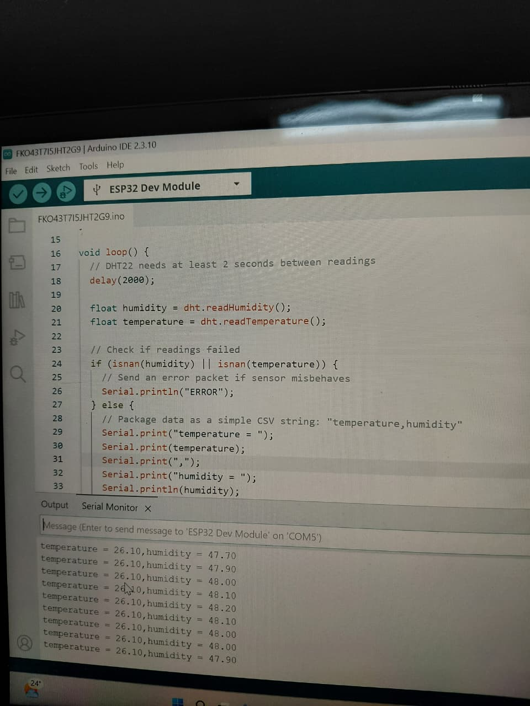

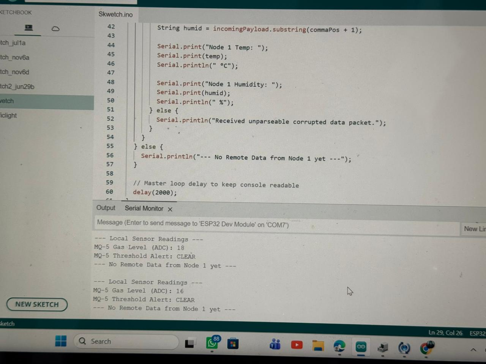

---

## C. Prototype C: 1 ESP32S connected to 1 DHT22 connected to 1 relay which is connected to another ESP32S connected to 1 MQ-5

### Implementation Strategy
For this device architecture, our team chose to develop a **simulated model** using Wokwi[https://wokwi.com/projects/468171968422865921]. 

### Device Schematic
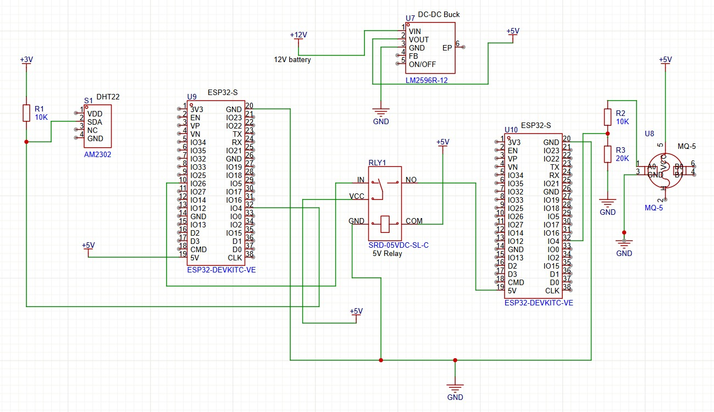

### Simulated Prototype
* **Wokwi Project Link:** [Wokwi Simulation C](https://wokwi.com/projects/468171968422865921)
* **Wokwi Implementation Diagram:**
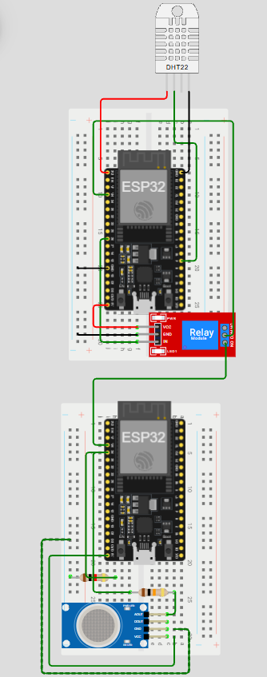

### Simulation Outputs
* **Output from First ESP32:**
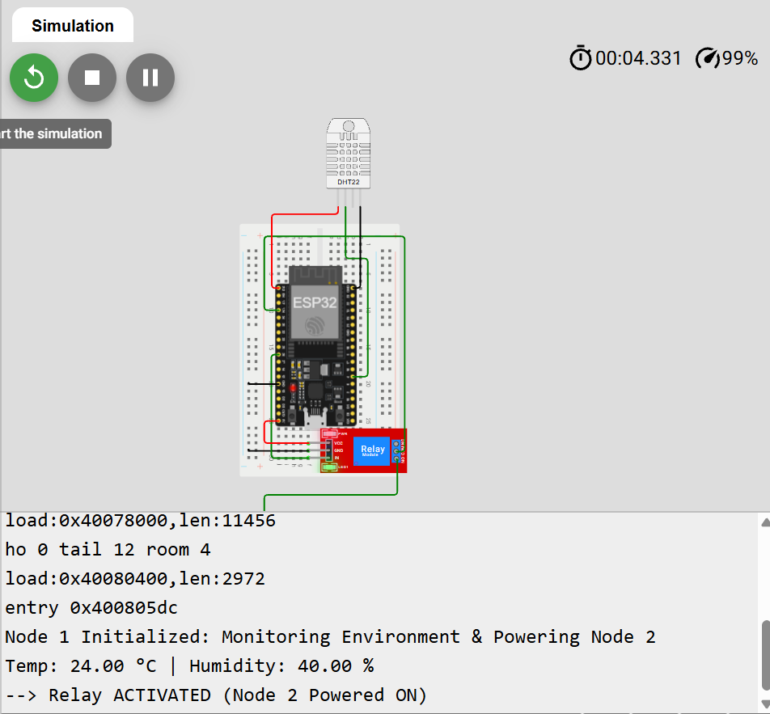

* **Output from Second ESP32:**
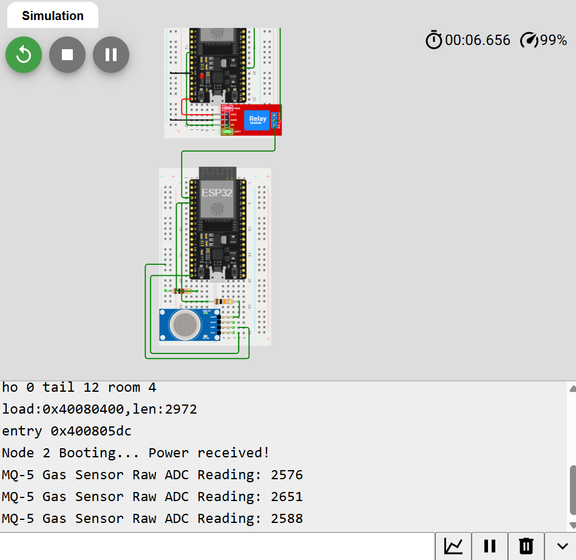

---

## Evidence of Groupwork
*(Placeholder: Insert your team meeting notes, GitHub commit history screenshots, or collaboration evidence here)*

