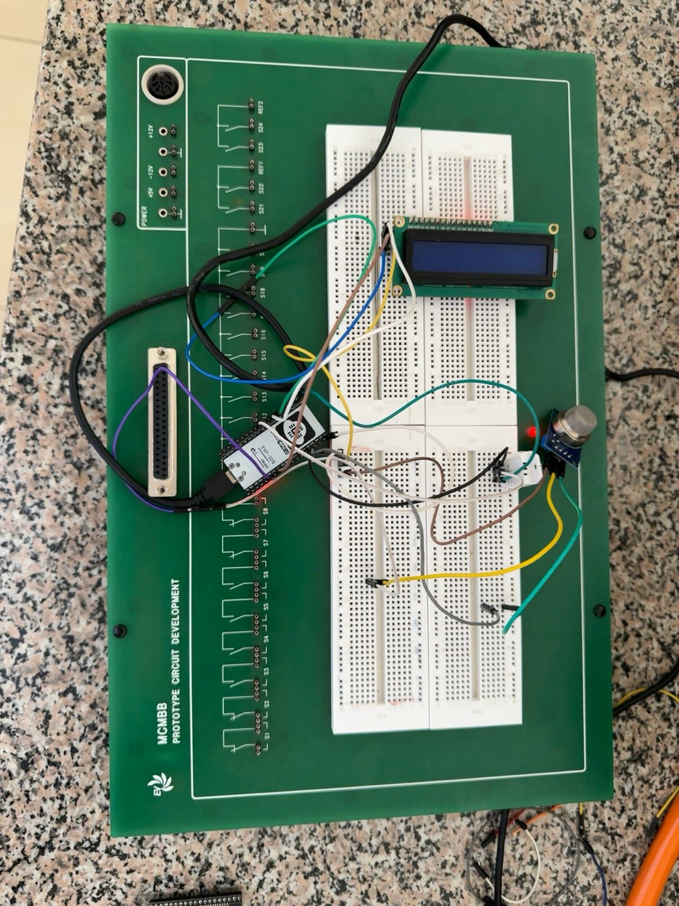
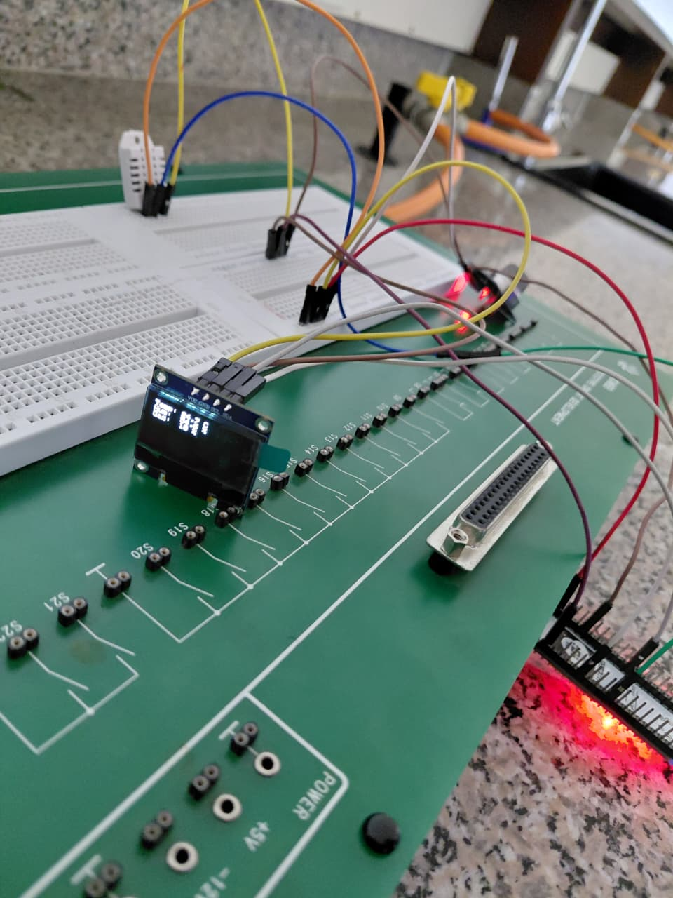
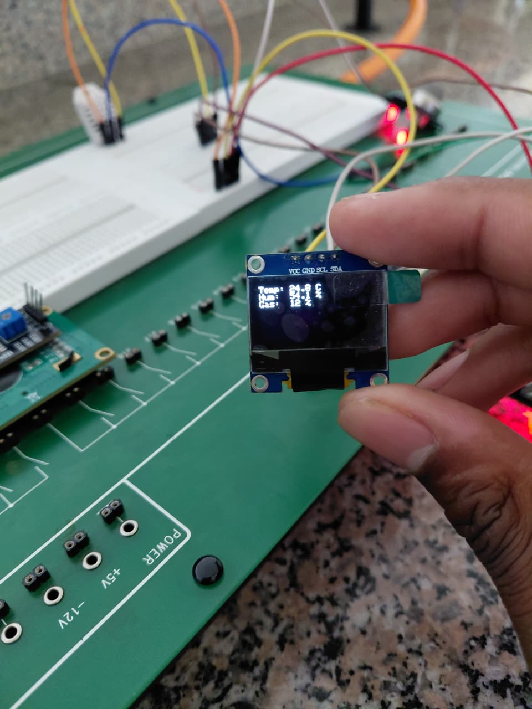

# ICS 4111: Embedded Systems & IoT - Semester Project: Deliverable 2

## A. Prototype A: 1 ESP32S connected to 1 MQ-5, 1 DHT22 and Display

### Simulated Prototype
* **Wokwi Project Link:** [Simulation A Link](https://wokwi.com/projects/468343920186370049)
* **Simulation Schematic:**

### Physical Prototype
* **Initial Physical Implementation:**

*(Placeholder for any additional physical media or videos if needed)*

### Challenges Encountered and Resolutions
**Technical Prototyping Issue:** During the physical prototyping phase for this architecture, the initial LCD display (visible in the initial prototype image) was not functioning correctly and failed to display the expected output from the sensors.

**Resolution/Workaround:**
To resolve this issue, the team swapped the malfunctioning LCD for an OLED display. This hardware change was successful, and the OLED properly outputted the sensor readings (Temperature, Humidity, and Gas levels).

* **OLED Output Implementation (Working State):**

---

## Evidence of Groupwork
*(Placeholder: Insert your team meeting notes, GitHub commit history screenshots, or collaboration evidence here)*

